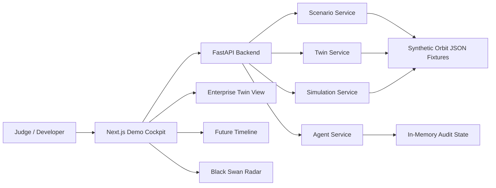
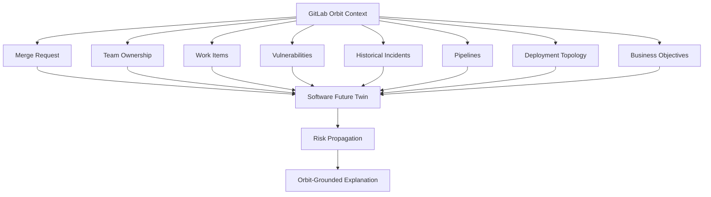
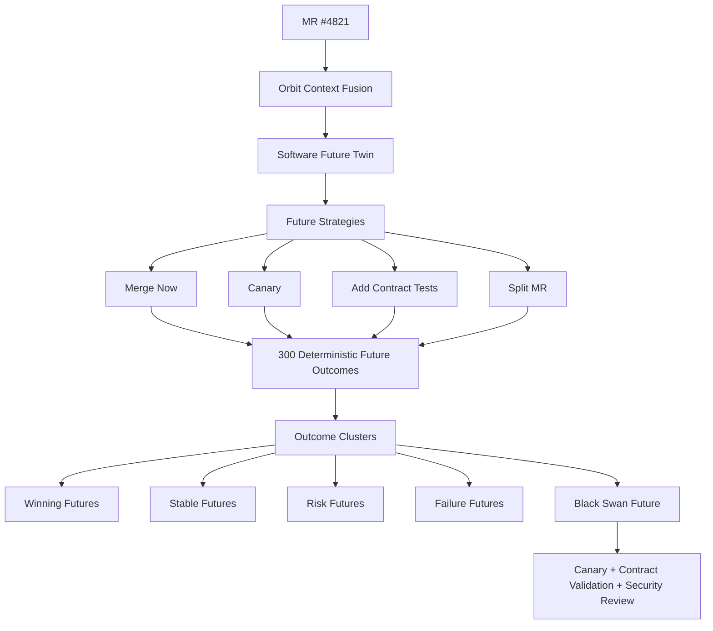
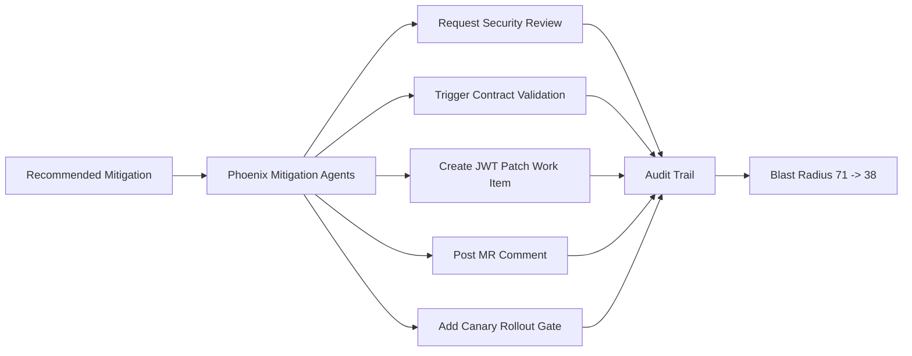

# Project Phoenix Architecture Diagrams

## System Architecture

```mermaid
flowchart LR
  User["Judge / Developer"] --> Web["Next.js Demo Cockpit"]
  Web --> API["FastAPI Backend"]
  API --> Scenario["Scenario Service"]
  API --> Twin["Twin Service"]
  API --> Simulation["Simulation Service"]
  API --> Agents["Agent Service"]
  Scenario --> Fixtures["Synthetic Orbit JSON Fixtures"]
  Twin --> Fixtures
  Simulation --> Fixtures
  Agents --> Audit["In-Memory Audit State"]

  Web --> TwinView["Enterprise Twin View"]
  Web --> Timeline["Future Timeline"]
  Web --> Radar["Black Swan Radar"]
```

## Orbit Context Flow

```mermaid
flowchart TD
  Orbit["GitLab Orbit Context"] --> MR["Merge Request"]
  Orbit --> Teams["Team Ownership"]
  Orbit --> Work["Work Items"]
  Orbit --> Vulns["Vulnerabilities"]
  Orbit --> Incidents["Historical Incidents"]
  Orbit --> Pipelines["Pipelines"]
  Orbit --> Deployments["Deployment Topology"]
  Orbit --> Objectives["Business Objectives"]

  MR --> Twin["Software Future Twin"]
  Teams --> Twin
  Work --> Twin
  Vulns --> Twin
  Incidents --> Twin
  Pipelines --> Twin
  Deployments --> Twin
  Objectives --> Twin

  Twin --> Propagation["Risk Propagation"]
  Propagation --> Explanation["Orbit-Grounded Explanation"]
```

## Future Simulation Flow

```mermaid
flowchart TD
  MR["MR #4821"] --> Context["Orbit Context Fusion"]
  Context --> Twin["Software Future Twin"]
  Twin --> Strategies["Future Strategies"]

  Strategies --> Merge["Merge Now"]
  Strategies --> Canary["Canary"]
  Strategies --> Tests["Add Contract Tests"]
  Strategies --> Split["Split MR"]

  Merge --> Outcomes["300 Deterministic Future Outcomes"]
  Canary --> Outcomes
  Tests --> Outcomes
  Split --> Outcomes

  Outcomes --> Clusters["Outcome Clusters"]
  Clusters --> Winning["Winning Futures"]
  Clusters --> Stable["Stable Futures"]
  Clusters --> Risk["Risk Futures"]
  Clusters --> Failure["Failure Futures"]
  Clusters --> BlackSwan["Black Swan Future"]

  BlackSwan --> Recommendation["Canary + Contract Validation + Security Review"]
```

## Agent Workflow

```mermaid
flowchart LR
  Recommendation["Recommended Mitigation"] --> AgentBus["Phoenix Mitigation Agents"]

  AgentBus --> Review["Request Security Review"]
  AgentBus --> Validation["Trigger Contract Validation"]
  AgentBus --> WorkItem["Create JWT Patch Work Item"]
  AgentBus --> Comment["Post MR Comment"]
  AgentBus --> Gate["Add Canary Rollout Gate"]

  Review --> Audit["Audit Trail"]
  Validation --> Audit
  WorkItem --> Audit
  Comment --> Audit
  Gate --> Audit

  Audit --> Reduced["Blast Radius 71 -> 38"]
```

